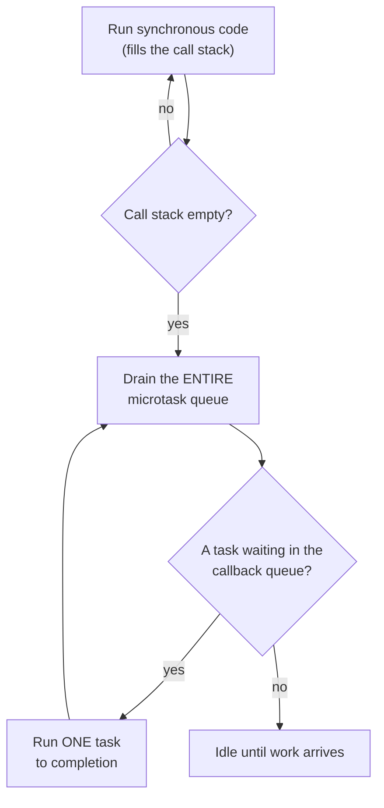
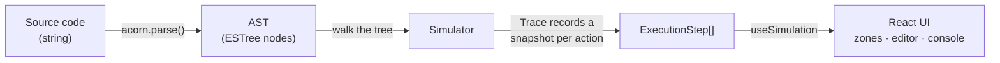
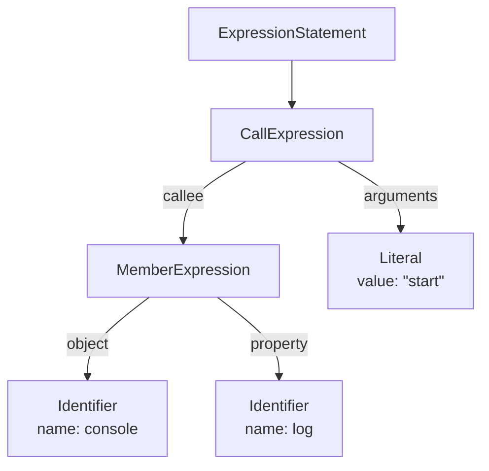
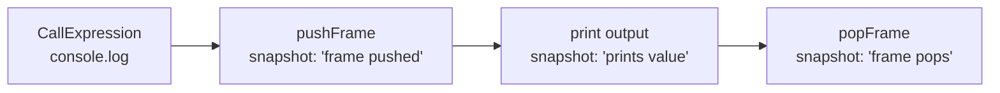

# JS Runtime Visualizer

An interactive tool that simulates how the JavaScript engine and event loop
execute code. Watch frames move between the **Call Stack**, **Web APIs**,
**Microtask Queue**, and **Callback Queue**, one step at a time.

> **Inspired by** Philip Roberts' talk _"What the heck is the event loop
> anyway?"_ (JSConf EU) — the canonical explainer this project brings to life:
> https://www.youtube.com/watch?v=8aGhZQkoFbQ


## Features

- **Write or pick code** — type your own JS in the CodeMirror editor, or load one
  of ten built-in snippets that cover the common event-loop interview questions.
- **Step-by-step execution** — Play, Pause, single Step, and Reset, with a speed
  slider for the auto-advance.
- **Four live zones** — cards animate between the Call Stack, Web APIs, Microtask
  Queue, and Callback Queue as execution proceeds.
- **Current-line highlight** — the line being executed lights up in the editor.
- **Event Loop indicator** — shows exactly when the loop checks whether the stack
  is empty and starts moving work onto it.
- **Console output** — prints in real execution order, including red stack traces
  for uncaught errors.
- **Explanation panel** — plain-English narration of what happens at every step.

## The runtime, one zone at a time

| Zone | What it is |
|------|------------|
| 🟦 **Call Stack** | Where functions actually run. Calling a function pushes a frame; returning pops it. It runs **one frame at a time** (LIFO), and it's single-threaded — while something is on the stack, nothing else can run. |
| 🟨 **Web APIs** | Capabilities the browser provides *off* the main thread — timers (`setTimeout`), network, DOM events. Async work waits here without blocking the stack. When it finishes, its callback is handed to a queue. |
| 🟪 **Microtask Queue** | Holds **promise** reactions (`.then` handlers, `await` continuations). Drained **completely** after each task and after the current synchronous run — before the next callback-queue task. |
| 🟩 **Callback Queue** | Holds **task** callbacks (`setTimeout`, events). The event loop takes **one** of these per tick, and only after the microtask queue is empty. |

The **Event Loop** is the referee tying them together: whenever the call stack is
empty, it drains all microtasks, then takes a single task from the callback
queue, runs it to completion, and repeats.

## The event loop's rulebook



An important rule to remember: **all microtasks run before the
next task.** That's why a `Promise.then` always beats a `setTimeout(…, 0)`
scheduled at the same time.

## Preset examples

Each preset isolates one concept, ordered from simplest to the classic mixed

| Preset | Teaches | Output |
|--------|---------|--------|
| Synchronous order | top-to-bottom execution | `start, middle, end` |
| Call stack (nested calls) | frames stacking as functions call functions | `16` |
| Uncaught error (stack trace) | a throw unwinding the stack into a trace | `Uncaught Error: Oops!` |
| setTimeout(0) | why a 0ms timer still runs last | `start, end, timeout` |
| Promise vs setTimeout | microtask beats task | `start, end, promise, timeout` |
| Multiple microtasks | microtasks drain fully, in order | `promise 1, promise 2, timeout` |
| async / await | `await` splits a function at a microtask boundary | `before, fetching, after, data` |
| Nested setTimeout | a timer scheduled from inside a timer | `outer, inner` |
| Promise chaining | each `.then` scheduled after the previous settles | `first, second, third` |
| The classic mix | everything at once | `1, 6, 3, 5, 2, 4` |

## How it works

The visualizer never actually runs the code. Instead it **parses** the source
into an Abstract Syntax Tree (AST) and "walks" that tree, recording a snapshot
of the runtime after each observable action. The UI then just scrubs through
those snapshots.



### What is an AST?

An **Abstract Syntax Tree** is the structured, tree-shaped representation a
parser produces from raw source text. It captures what the code *is*: calls,
literals, arguments; and discards formatting noise like spaces and comments.

For example, this single line:

```js
console.log("start");
```

is parsed into this tree:



### From a node to snapshots

Walking a single `console.log(...)` call produces three snapshots, so you can
watch the frame enter the stack, do its work, and leave:



The `Trace` builder holds one mutable working state and copies it into an
immutable `ExecutionStep` each time `snapshot()` is called. `RuntimeItem`
objects are created once and reused across snapshots, so their identity is
stable, that is what will let the animation layer follow a single card as it
moves between zones.

## Interview Q&A

<details>
<summary><strong>What is the event loop?</strong></summary>

The event loop is the mechanism that lets single-threaded JavaScript handle
asynchronous work without blocking. JavaScript can only do one thing at a time
(one call stack). The event loop is a continuous process that asks, over and
over: _"is the call stack empty?"_ When it is, the loop first drains every
queued **microtask**, then takes **one** callback from the **task (callback)
queue** and pushes it onto the stack to run. Async APIs (timers, network) do
their waiting off the main thread and hand a callback to a queue when they're
done — the event loop is what eventually moves that callback onto the stack.
</details>

<details>
<summary><strong>What is the call stack?</strong></summary>

The call stack is the data structure that tracks _where the program currently
is_. Calling a function **pushes** a frame onto the top; returning **pops** it
off. It's LIFO (last in, first out) and single-threaded — only the top frame is
running, and nothing else (no timer callback, no promise) can run until the
stack is empty again. If a function throws and nothing catches it, the stack at
that moment becomes the **stack trace**, and the error unwinds every frame. Try
the _"Uncaught error (stack trace)"_ and _"Call stack (nested calls)"_ presets to
watch this happen.
</details>

<details>
<summary><strong>What's the difference between the microtask queue and the callback (task) queue?</strong></summary>

Both hold callbacks waiting to run, but they have **different priorities**:

- **Microtask queue** — promise reactions (`.then`/`catch`/`finally` handlers and
  `await` continuations), plus `queueMicrotask`. After each task and after the
  current synchronous script, the event loop **drains the entire microtask queue**
  before doing anything else. Microtasks queued _while_ draining are also run in
  the same pass.
- **Callback (task / macrotask) queue** — `setTimeout`/`setInterval` callbacks and
  DOM events. The loop runs **one** task per iteration, and only when the
  microtask queue is empty.

So microtasks always beat tasks. Given a `Promise.then` and a `setTimeout(…, 0)`
scheduled together, the promise handler runs first — every time.
</details>

<details>
<summary><strong>Why doesn't <code>setTimeout(fn, 0)</code> run immediately?</strong></summary>

`0` is a **minimum delay, not a guarantee**. `setTimeout` doesn't run `fn` — it
hands `fn` to the browser's timer (a Web API) and returns immediately. The
callback can only run when **two** conditions are met: the delay has elapsed
*and* the call stack is empty. Since the rest of your synchronous code is still
on the stack, the timer callback has to wait until all of it finishes (and until
every microtask drains too). That's why in

```js
console.log("start");
setTimeout(() => console.log("timeout"), 0);
console.log("end");
```

the output is `start, end, timeout` — `timeout` runs last, after the stack
clears. (Browsers also clamp nested timers to ~4ms, so `0` is never truly zero.)
</details>

<details>
<summary><strong>How does async/await relate to promises?</strong></summary>

`async`/`await` is **syntax sugar over promises and microtasks** — not a new
concurrency model. An `async` function always returns a promise, and `await` is
essentially a `.then()`:

- An async function runs **synchronously up to its first `await`**.
- At the `await`, the function **pauses**, and everything after it is scheduled as
  a **microtask** (the continuation). Control returns to the caller.
- When the stack is empty, the microtask resumes the function with the awaited
  value.

So this:

```js
async function fetchData() {
  console.log("fetching");
  const result = await Promise.resolve("data");
  console.log(result);
}
```

behaves like:

```js
function fetchData() {
  console.log("fetching");                       // synchronous
  return Promise.resolve("data").then((result) => {
    console.log(result);                         // microtask, runs later
  });
}
```

That's why, in the _async / await_ preset, `fetching` prints synchronously
(before `after`), while `data` prints only after the synchronous code finishes.
</details>

## Running locally

Requires **Node 18+**.

```bash
npm install       # install dependencies
npm run dev       # start the dev server → http://localhost:5173
npm run build     # type-check and build for production (dist/)
npm run preview   # preview the production build
```

## Tech stack

- **React 18 + TypeScript** — UI and strict typing
- **Vite** — dev server and bundler
- **Tailwind CSS** — styling (class-based dark theme)
- **Framer Motion** — zone-to-zone card animations
- **CodeMirror 6** — the code editor with syntax highlighting
- **acorn** — parses source into the ESTree AST the simulator walks

The simulator implements the slice of JavaScript needed to teach the event loop,
not a full interpreter. It understands `console.log`, `setTimeout`,
`Promise.resolve().then(...)` chains, `async`/`await`, user-defined function calls
(with arguments, return values, and basic arithmetic), variable bindings, and
`throw`. Timers are ordered by their delay on a virtual clock rather than real
wall-clock time. Constructs outside this subset (loops, conditionals, classes,
real network calls) are intentionally skipped — the goal is a clear mental model,
not an execution engine.
