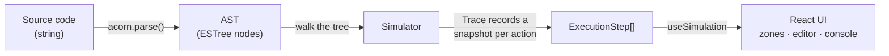
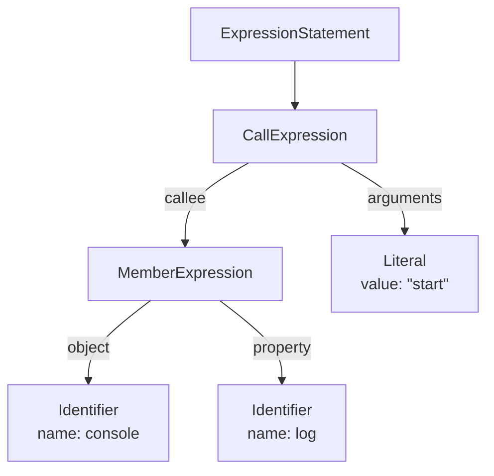
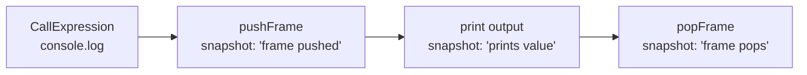

# JS Runtime Visualizer

An interactive tool that simulates how the JavaScript engine and event loop
execute code. Watch frames move between the **Call Stack**, **Web APIs**,
**Microtask Queue**, and **Callback Queue**, one step at a time.

## How it works

The visualizer never actually runs the code. Instead it **parses** the source
into an Abstract Syntax Tree (AST) and "walks" that tree, recording a snapshot
of the runtime after each observable action. The UI then just scrubs through
those snapshots.



### What is an AST?

An **Abstract Syntax Tree** is the structured, tree-shaped representation a
parser produces from raw source text. It captures what the code *is*: calls,
literals, arguments; and discards formatting noise like spaces and comments.

For example, this single line:

```js
console.log("start");
```

is parsed into this tree:



### From a node to snapshots

Walking a single `console.log(...)` call produces three snapshots, so you can
watch the frame enter the stack, do its work, and leave:



The `Trace` builder holds one mutable working state and copies it into an
immutable `ExecutionStep` each time `snapshot()` is called. `RuntimeItem`
objects are created once and reused across snapshots, so their identity is
stable, that is what will let the animation layer follow a single card as it
moves between zones.
